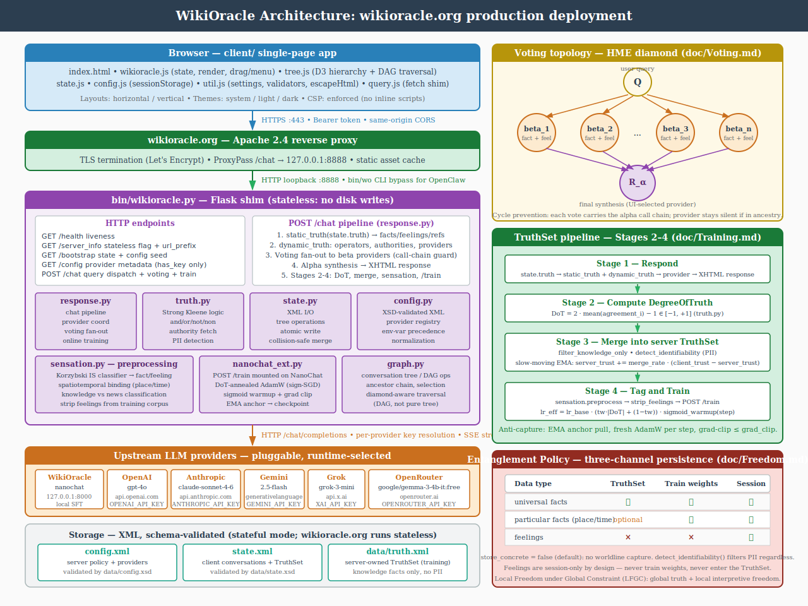
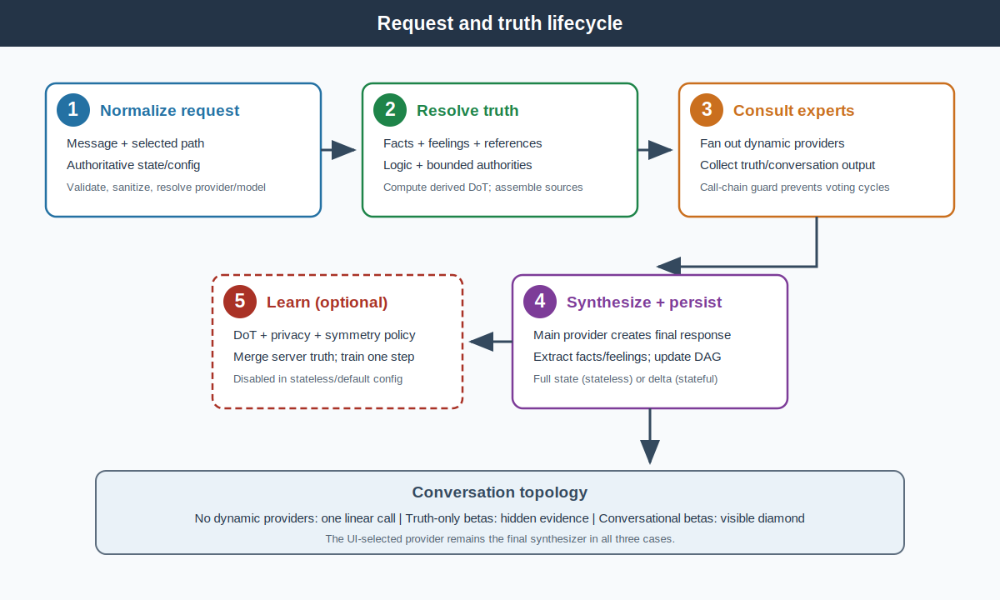

# Implementation

## System Overview

WikiOracle is a Flask orchestration layer between a browser/CLI client and one or more model providers. It combines a recursive conversation graph, typed truth, provider voting, encrypted storage integration, and optional online learning.

### Components

| Layer | File(s) | Responsibility |
|---|---|---|
| Flask application | `bin/wikioracle.py` | Routes, runtime contracts, authentication/CSRF/rate limiting, Dropbox OAuth, encrypted storage, and static UI serving |
| Configuration | `bin/config.py` | Baseline/override XML loading, provider registry, client-safe projection, environment/runtime settings, XML writer |
| State | `bin/state.py` | XML/legacy JSON loading, tree/DAG normalization, selection, serialization, atomic writes, collision-safe merge |
| Conversation graph | `bin/graph.py` | Lookup, ancestry, context paths, selection, flattening, and traversal helpers |
| Response pipeline | `bin/response.py` | Prompt bundles, truth/provider coordination, adapter calls, HME fan-out, conversation construction, online-training dispatch |
| Truth engine | `bin/truth.py` | Typed truth normalization, Strong Kleene `and/or/not/non`, authority/reference resolution, DoT, privacy classification, server-truth merge |
| Sensation | `bin/sensation.py` | Fact/feeling tagging, Korzybski IS classification, spatiotemporal labeling, corpus/SFT preparation |
| NanoChat extension | `bin/nanochat_ext.py` | `/train` route, DoT-annealed AdamW, warmup, gradient clipping, and EMA anchoring |
| BasicModel service | `basicmodel/bin/serve.py` | Local OpenAI-compatible BasicModel inference on port 8001 by default |
| OpenClaw bridge | `bin/wo`, `openclaw/extensions/wikioracle/` | CLI and provider/command/tool integration for OpenClaw channels |
| Browser shell | `client/index.html`, `client/*.css` | Settings, tree/chat panels, dialogs, editor surfaces, responsive layout |
| Browser controller | `client/wikioracle.js` | State transitions, message rendering, branching, selection, provider requests |
| Browser state/config | `client/state.js`, `client/config.js` | Browser persistence plus XML config conversion |
| Browser graph | `client/graph.js`, `client/tree.js` | Conversation merge/traversal and D3 rendering |
| Browser utilities/storage | `client/util.js`, `client/storage.js`, `client/query.js` | Editors, settings, Dropbox/QR workflow, and API requests |
| Schemas | `data/state.xsd`, `data/config.xsd` | Canonical XML contracts |
| Tests | `test/test_*.py` | State/config roundtrip, stateless contract, security, voting, truth, training, and UI-string coverage |

## HTTP API

Every route is prefixed by the effective `url_prefix`. POST requests require `X-Requested-With: WikiOracle`. When `WIKIORACLE_API_TOKEN` is set, non-public routes also require the configured bearer token.

### Core and Status

| Method | Path | Purpose |
|---|---|---|
| GET | `/health` | Flask liveness check |
| GET | `/nanochat_status` | Probe the configured local WikiOracle/NanoChat upstream |
| GET | `/basicmodel_status` | Probe BasicModel on its configured/default endpoint |
| GET | `/server_info` | Report stateless mode, prefix, and training availability |
| GET | `/bootstrap` | Return seed state and client-safe config |
| GET | `/info` | Return state/schema/provider/startup-merge diagnostics |

### State, Chat, and Config

| Method | Path | Purpose | Stateless behavior |
|---|---|---|---|
| GET | `/state` | Read canonical or in-memory state | Returns memory/seed state |
| POST | `/state` | Replace state | Replaces memory state; no disk write |
| POST | `/new` | Reset to an empty session | Replaces memory state |
| GET | `/state_size` | Report local state-file size | Reports seed-file size if present |
| POST/OPTIONS | `/chat` | Process one conversation turn | Requires `state` and `runtime_config`; returns full state |
| POST/OPTIONS | `/merge` | Merge state payloads or adjacent import files | Rejected because writes are disabled |
| GET | `/config` | Return the client-safe canonical config | Allowed |
| POST | `/config` | Replace only the `client` section and persist | Rejected because the shared server config cannot be mutated |

### Dropbox and Authority Storage

| Method | Path | Purpose |
|---|---|---|
| GET | `/auth/dropbox/start` | Begin Dropbox OAuth2 |
| GET | `/auth/dropbox/callback` | Complete OAuth2 and save tokens in the Flask session |
| GET | `/auth/dropbox/status` | Report whether Dropbox is configured/connected |
| POST | `/auth/dropbox/logout` | Clear Dropbox tokens from the session |
| GET | `/storage/status` | Check for encrypted config/state bundles |
| POST | `/storage/save` | Encrypt and upload state/config; optionally return authority QR data for state-only sharing |
| POST | `/storage/load` | Download, decrypt, and return/persist state or client-safe config |
| POST | `/authority/conversations` | Fetch conversations from an authority URL, optionally with a decryption key |

### UI Assets

| Method | Path | Purpose |
|---|---|---|
| GET | `/` | Serve `client/index.html` without caching |
| GET | `/<path>` | Serve an existing asset under `client/` when its extension is allowlisted |

## Request and State Contracts

| Contract | Client sends | Server reads | Server returns | Durable authority |
|---|---|---|---|---|
| Stateful `/chat` | Message, routing IDs, query config, and optionally client truth | State/config from disk, with supplied truth overriding state truth for the turn | Display text plus selected conversation delta | Local `state.xml`; client retains its own truth copy |
| Stateless `/chat` | Message, routing IDs, complete authoritative state, and runtime config | Request only | Display text plus complete updated state | Browser/CLI client |

The stateless contract never uses disk or a previous in-memory state as an implicit input to `/chat`. The stateful contract persists the complete updated state, but its chat response deliberately omits truth and config.

## Chat Routing

| Request fields | Routing behavior |
|---|---|
| `conversation_id` | Continue an existing conversation |
| `branch_from` | Create a child branch below the specified conversation |
| Neither | Create a root conversation |
| Empty message at root/terminal/pending branch | Create a valid continuation/branch turn without a user message |

When conversational beta providers participate, the graph becomes a diamond: a query node fans out to beta child conversations, and one final conversation is shared as a child of all participating beta nodes.

## Truth and Provider Pipeline

The pipeline does not call a `dynamic_truth()` helper. Instead, it normalizes direct sources, computes logic, resolves provider entries, and assembles one final `ProviderBundle`.

| Step | Key implementation | Effect |
|---|---|---|
| Direct-source extraction | `static_truth()`, `direct_truth_sources()` | Extract facts, feelings, and references from the client TruthSet |
| Logic derivation | `compute_derived_truth()` | Recompute `and`, `or`, `not`, and `non` entries and attach derived certainty |
| Authority/reference resolution | `bin/truth.py` resolvers | Fetch only allowlisted sources with size/depth limits |
| Beta consultation | `evaluate_providers()` | Query dynamic truth providers; separate conversational and truth-only contributions |
| Main synthesis | `build_query()`, `_call_provider()` | Send history, truth, derived evidence, and beta output to the UI-selected provider |
| Structured extraction | `_extract_direct_truths()` | Separate `<conversation>` display output from returned facts/feelings |
| Graph update | `process_chat()` | Add a linear turn or construct a voting diamond |
| Optional learning | `process_chat()` plus `nanochat_ext.py` | Merge permitted truth and dispatch a bounded training step |

Structural entries are not treated as prose claims. Logic yields derived DoT, authorities yield imported evidence, and providers yield expert contributions. With no dynamic provider entries, the pipeline makes one main-provider call.

## Thought-Free Mode

| Target | Behavior |
|---|---|
| External LLM adapters | Adds the non-discursive constraint prompt to the system bundle |
| BasicModel | Sends `thought_free=true`; the BasicModel service applies its restricted grammar path for the request |
| Browser display | Strips supported thinking blocks before display according to client preference |

The preference originates at `config.client.thought_free`, enters the query bundle, and reaches `_call_provider()`.

## Security Middleware

| Control | Implementation |
|---|---|
| Request size | Flask `MAX_CONTENT_LENGTH` from `WIKIORACLE_MAX_STATE_BYTES` |
| Message length | `WIKIORACLE_MAX_INPUT_LEN` |
| Input guard | `guard_input()` rejects configured prompt-injection patterns |
| Authentication | Optional exact bearer-token match |
| CSRF | Required `X-Requested-With: WikiOracle` on POST |
| Rate limit | Sliding per-IP limit; chat and default RPM are configurable |
| Browser policy | Restrictive CSP and allowlisted CORS origins |
| Static files | Extension allowlist plus resolved-path containment check |
| State files | Optional symlink rejection and atomic replace |

## State Library Reference

| Function | Purpose |
|---|---|
| `state_to_xml(state)` | Serialize normalized state to typed XML |
| `xml_to_state(text)` | Parse typed XML into normalized runtime state |
| `atomic_write_xml(path, state)` | Temporary-file, `fsync`, atomic-rename write |
| `load_state_file(path)` | Read XML or legacy monolithic JSON |
| `find_conversation(conversations, id)` | Recursive tree/DAG lookup |
| `get_ancestor_chain(conversations, id)` | Resolve all ancestors for context/navigation |
| `get_context_messages(conversations, id)` | Build ordered path context |
| `add_message_to_conversation(...)` | Append a message |
| `add_child_conversation(...)` | Add a branch |
| `remove_conversation(...)` | Delete a subtree |
| `merge_llm_states(base, incoming)` | Merge state with deterministic collision-safe identifiers |
| `ensure_minimal_state(state)` | Normalize required defaults and selection invariants |
